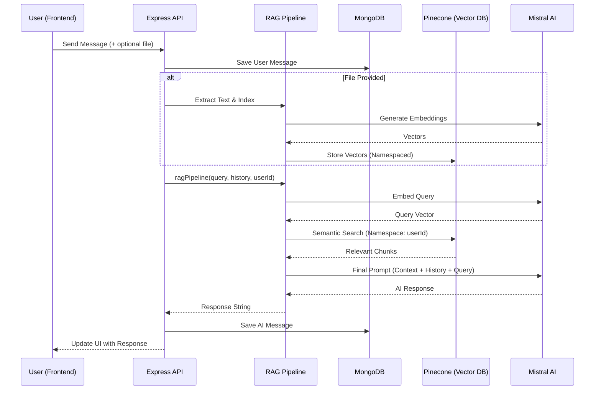

# 🚀 Perplexity AI - Full-Stack RAG Chat Application

This project is a high-performance **Full-Stack AI Chat Application** built using the **MERN** stack, augmented with **Retrieval-Augmented Generation (RAG)**. It allows users to have intelligent conversations with an AI that can "remember" uploaded documents and search through them using semantic vector search.

---

## 1. 🧠 Project Overview

*   **App Purpose**: A private, document-aware AI assistant.
*   **Key Features**:
    *   **Real-time Chat**: Interactive conversation with history.
    *   **File Upload & Indexing**: Support for PDF, Images, and Text files.
    *   **Semantic RAG Search**: Uses vector embeddings to find relevant facts from your own data.
*   **Why RAG?**: LLMs have a knowledge cutoff and limited context windows. RAG provides the model with specific, up-to-date information from the user's own documents without needing to re-train the model.

---

## 2. 🔄 FULL SYSTEM FLOW

The diagram below shows how a message travels from the browser to the AI and back, incorporating the RAG pipeline.

---

## 3. 🎨 FRONTEND ARCHITECTURE

The frontend is a modern React application focused on a seamless chat experience.

*   **Structure**: 
    - `src/features/chat`: Contains UI components like `MessageList`, `ChatInput`, and `Sidebar`.
    - `src/features/chat/services`: Contains `chat.api.js` for all backend communication.
*   **API Integration**: Uses `axios` with `withCredentials: true` for secure, cookie-based sessions.
*   **File Upload**: Uses `FormData` to send binary files (PDF/Images) to the backend via `multipart/form-data`. When a file is included, the request is encoded as `multipart/form-data`; otherwise it is sent as plain `application/json`.
*   **State Management**: Locally managed chat state that updates optimistically when messages are sent.

> ℹ️ **File + Query in one request**: A user can attach a file and type a query simultaneously. The backend processes these atomically — the file is indexed **first**, and the resulting vectors are **immediately** searchable within the same pipeline execution. There is no delay or second request needed.

---

## 4. ⚙️ BACKEND ARCHITECTURE

A modular Node.js/Express server following the **Controller-Service-Model** pattern.

*   **Controllers (`/controller`)**: Handle HTTP request validation and response formatting.
*   **Services (`/services`)**: Contain core business logic (RAG, AI interactions, file processing).
*   **Models (`/models`)**: Mongoose schemas for `User`, `Chat`, `Message`, and `File`.
*   **Routes (`/routes`)**: Define the API surface (e.g., `/api/chats/message`).

---

## 5. 🧠 RAG SYSTEM (CORE)

The RAG system is split into two distinct workflows: **Indexing** and **Retrieval**.

### 🔹 Indexing Flow (Storing Knowledge)
1.  **Extraction**: `extractTextFromFile` pulls text from PDFs, Text files, or uses ImageKit OCR for images.
2.  **Chunking**: `chunker.js` splits long documents into smaller, overlapping segments (chunks).
3.  **Embedding**: `mistral-embed` model converts text chunks into 1024-dimension numerical vectors.
4.  **Storage**: Vectors are stored in **Pinecone** under a specific `namespace` (the user's ID).

### 🔹 Retrieval Flow (Finding Knowledge)
1.  **Query Embedding**: The user's question is converted into a vector.
2.  **Vector Search**: Pinecone searches for the top-5 most similar chunks within the user's namespace.
3.  **Context Assembly**: Matches are joined together as a single block of reference text.

### 🔹 Pipeline Flow (The Brain)
The `ragPipeline` orchestrates the final AI response:
*   Combines **Retrieved Context** + **Recent Chat History** + **System Instructions**.
*   Builds a prompt that says: *"Use ONLY the facts below to answer. If not found, use general knowledge."*
*   Sends the full payload to Mistral LLM.

---

## 6. 🔐 MULTI-USER ISOLATION

Security is built into the data layer:
*   **MongoDB**: Every `Chat` and `File` record is linked to a `user` ID.
*   **Pinecone Namespaces**: We use the `userId.toString()` as the namespace in Pinecone. This ensures that even if two users upload the same document, their search results never mix. One user can NEVER retrieve another user's document data.

---

## 7. 📂 FILE HANDLING SYSTEM

*   **Processing**: Uses `multer` (memory storage) to handle uploads.
*   **Hashing**: Generates a **SHA-256 hash** of the file buffer.
*   **Duplicate Detection**: Before indexing, the backend checks if a file with the same hash already exists for that user. If found, it skips re-embedding to save API costs and DB space.

---

## 8. 💬 CHAT SYSTEM FLOW

1.  **Message Creation**: Every message is stored in MongoDB with a `role` ("user" or "ai").
2.  **History Management**: The backend retrieves the last 10 messages to provide continuity to the AI.
3.  **Title Generation**: When a new chat starts, the AI automatically generates a short, relevant title based on the first message.

---

## 9. 🔗 FRONTEND ↔ BACKEND CONNECTION

| Endpoint | Method | Purpose | Payload |
| :--- | :--- | :--- | :--- |
| `/api/chats/message` | POST | Send a message | `{ message, chatId, file? }` |
| `/api/chats/:chatId` | GET | Load a conversation | N/A |
| `/api/chats/` | GET | List all user chats | N/A |
| `/api/chats/delete` | DELETE | Remove a chat | `{ chatId }` |

---

## 10. ⚙️ KEY FUNCTIONS BREAKDOWN

*   `sendMessageController()`: Entry point; handles the HTTP request/response cycle.
*   `processChatMessage()`: shared logic for creating DB records and triggering RAG.
*   `ragPipeline()`: The "orchestrator" that calls retriever and then the LLM.
*   `retrieveDocuments()`: Handles the Pinecone semantic search logic.
*   `indexDocument()`: Handles the chunking and vector storage logic.

---

## 11. 🚨 IMPORTANT DESIGN DECISIONS

*   **Why Pinecone?**: MongoDB is great for text, but terrible for "semantic similarity." Pinecone allows us to find "related" ideas even if the words don't match exactly.
*   **Why Embeddings aren't in MongoDB**: Vectors are large and require specialized indexing (HNSW) to search quickly. Specialized vector DBs like Pinecone are 100x faster for this.
*   **Why Overlapping Chunks?**: We split text with a small overlap so that no context is lost at the boundaries of a split.

---

## 12. 📈 FUTURE IMPROVEMENTS

1.  **Streaming**: Implement Server-Sent Events (SSE) or WebSockets to show AI responses word-by-word.
2.  **Hybrid Search**: Combine keyword search (BM25) with vector search for better accuracy.
3.  **Re-ranking**: Use a "Cross-Encoder" to re-rank the top Pinecone results before sending to the LLM.
4.  **UI Enhancements**: Add markdown rendering (code highlighting, tables) in the chat bubbles.
5.  **Caching**: Use Redis to cache embeddings for frequently asked questions.

---

**Generated by Antigravity AI**
